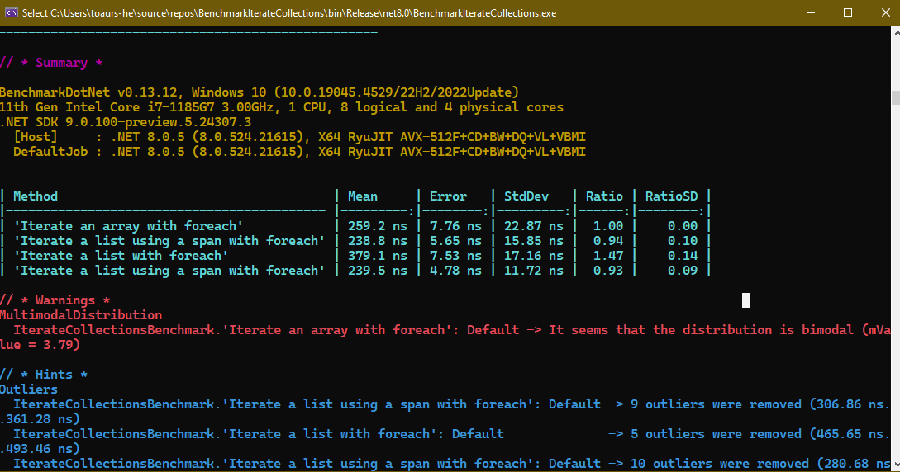

## Benchmark of iterating collections

Simple benchmarks of iterating collections. 

- Array 
- List

Span will be used to iterate also, the benchmark compares the performance of this.

Benchmarks will be done using Benchmark DotNet.

Results after a benchmark run: 

Iterating an array using a span actually ran 6% faster than 
iterating an array without using the span. 

Iteating a list using a span ran some 50% faster than 
iterating the list using the span. 

Screenshot:

